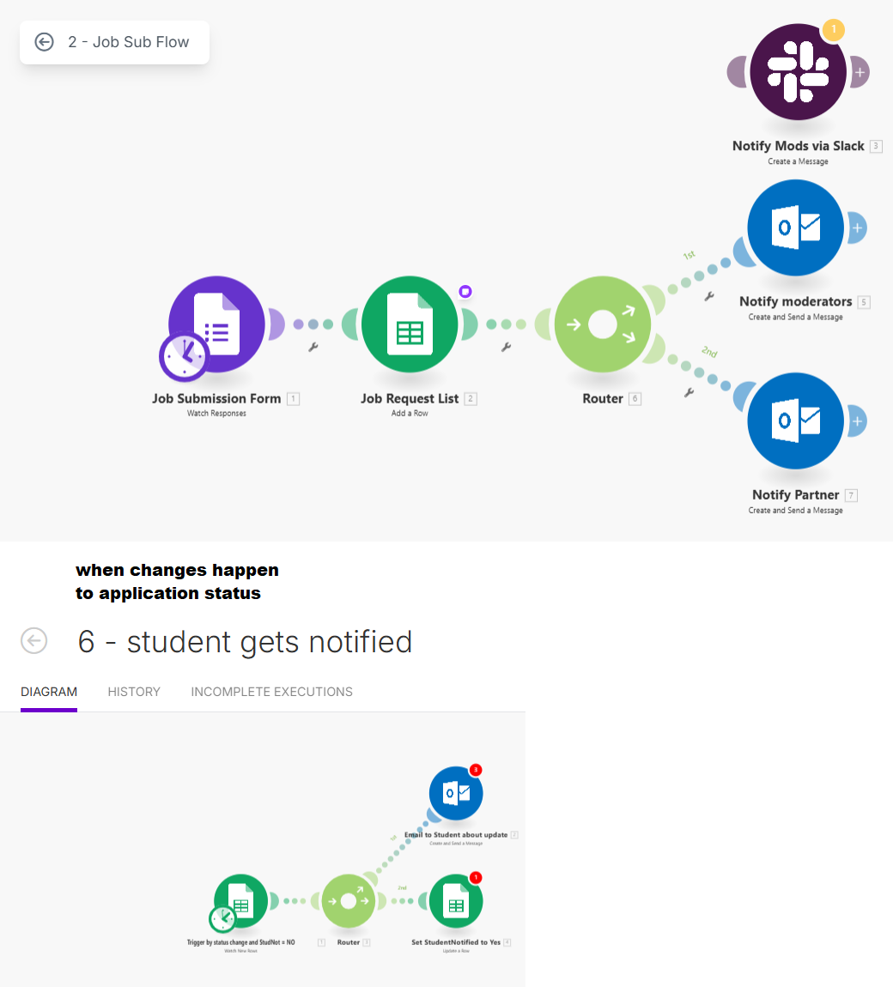

# 42make 🚀

> 🥈 2nd Prize Winner – Make.com x 42 School Hackathon

**42make** is a fully no-code solution built entirely on [Make.com](https://www.make.com), developed during the Make.com & 42 School Hackathon. This project showcases how complex OAuth authentication and API interaction can be achieved without writing a single line of backend code or hosting any web pages.

---
**Test URL** [42Make](https://hook.eu2.make.com/4yvw15bvak7v9gdb7vntpn6nomr9itpi)
- it's also mobile frindly
- [QR Code](./images/qr.jpg)
---

## 🧠 How It Works

This project leverages **Make.com** webhooks and workflows to act as a full-stack web app using only automation scenarios. Here's how the flow works:

### 1. Initial Webhook (Login Initiation)

- The entry point is a **Make.com webhook**.
- Checks whether the user is already logged in using a session check.
- If **logged in**, the request is routed to the second workflow.
- If **not logged in**, it initiates an **OAuth2 flow** with the 42 API (Intra).
- After successful login, the user is redirected to the **second workflow**.

**📸 First Workflow: Login & OAuth Handling**  

---

### 2. Authenticated UI Rendering

- Begins with a webhook that checks the session again.
- If the session is invalid, it redirects the user back to the first workflow.
- If valid, it responds with an **HTML + JavaScript** response directly from Make.com.
- This HTML UI interacts with the 42 API via another Make.com workflow, used as a **proxy** to bypass CORS restrictions.
- based on user request we get the data for intership and user data from 42 API

**📸 Second Workflow: Authenticated User Interface**  

---

### 3. Proxy API Communication

- This workflow acts as a **CORS-safe proxy** between the frontend JS and the 42 API.
- Ensures secure, policy-compliant data exchange.

**📸 Third Workflow: CORS Proxy to 42 API**  

---

### 4. Internship Application Workflow

- If a user applies for an internship, this workflow:
  - Captures the application data.
  - Creates a new row in a connected **Google Sheet**.

**📸 Internship Application Workflow**  

---

### 5. Post-Application Processing

- This workflow runs on the same Google Sheet.
- Processes applications, adds flags, or sends notifications (custom logic applied here).

**📸 Application Processing Workflow**  

---

### 6. Create Job by partner or staff workflow

- this work the same as Application workflow.
- to test it after login as student in console log run fakeit()
---

## 🛠️ Tech Stack

- **Platform**: [Make.com](https://www.make.com)
- **OAuth**: 42 Intra API
- **Frontend**: HTML/JS served via Make.com webhook responses
- **Data Store**: 42 Intra API, Google Sheets
- **No backend**, **no web hosting**, 100% Make.com-powered.

---

## 🏆 Built At

> **Make.com x 42 School Hackathon**  
> 🥈 Won 2nd Place among innovative automation solutions

---

## 📸 Workflow Summary

| Title                          | Image                          |
|-------------------------------|--------------------------------|
| Login & OAuth Handling        |  |
| Authenticated User Interface  |  |
| CORS Proxy to 42 API          |  |
| Internship Application        |  |
| Application Processing        |  |

---

## 📬 Contact

For questions or to learn more about the project, feel free to reach out!

---

